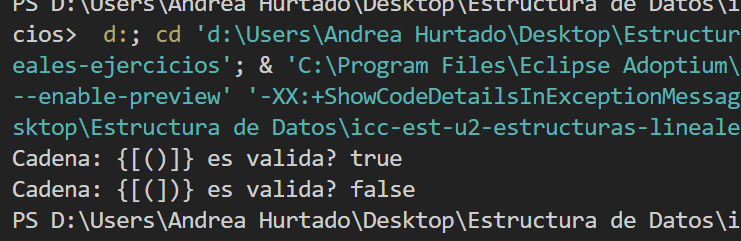
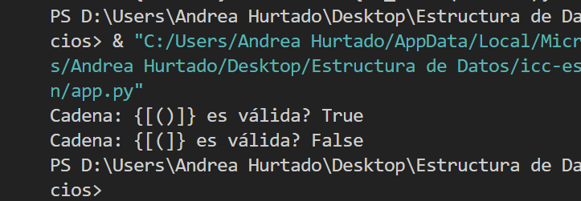
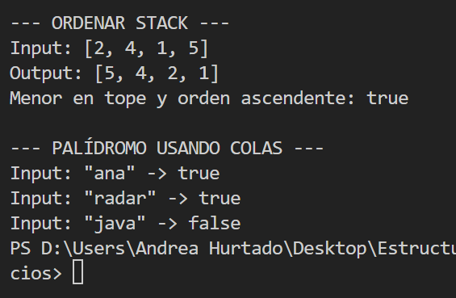

# Estructura de Datos
Estudiante: Andrea Hurtado

Estructuras Lineales 15-12-25

- Ejercicio 01

Explicación: Verifica si una cadena compuesta por los caracteres "()[]{}", en caso de validar caracteres que no son iguales, imprime falso.

Descripción de la solución: Se utiliza una estructura de datos tipo Stack porque permite que el ultimo en entrar, sea el primero en salir (principio LIFO).

Salidas en Java y Python ->

Java:

Python:

- Ejercicio 02 y 03: 

Explicación 02: Implementar un algoritmo que ordene un Stack de manera que los elementos más pequeños queden en el tope del Stack.

Descripción de la solución 02: Dado un Stack de enteros, se debe reordenar su contenido usando otro Stack auxiliar, respetando las reglas de esta estructura de datos.

Explicación 03: El objetivo es determinar si un String es palíndromo, o sea, se lee igual de izquierda a derecha y de derecha a izquierda utilizando colas.

Descripción de la solución 03: Se aprovecha el comportamiento FIFO (primero en entrar, es el primero en salir) de las colas para comparar el orden original con el orden invertido.

Salida Ejercicio 02 y 03

